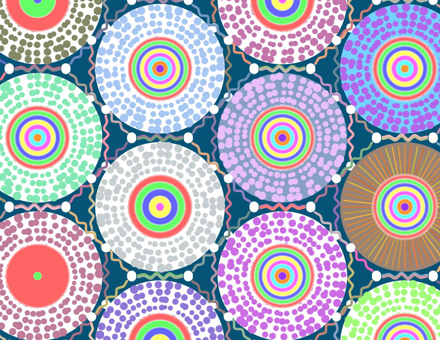
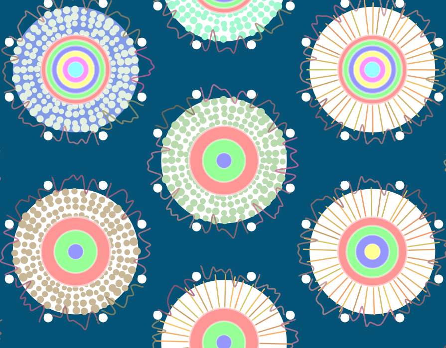
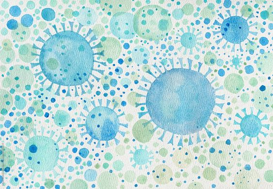
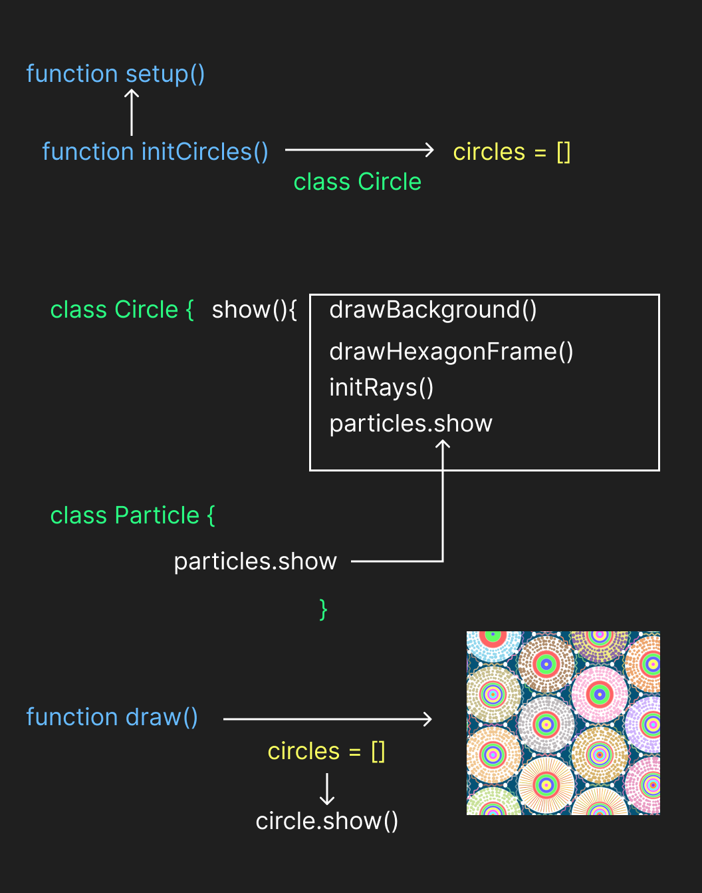

# pcai0714_9103_tut4

## Part 1: Instructions

1. Because I used perlin noise and random seeds to make the whole static picture move.Continuous animation is achieved by adding loop () and timeOffset.

2. Below is a comparison of group images and individual images





## Part 2: inspiration

My initial idea was to bring artworks to life. Some artworks would use the method of simulating biology to add vitality, so I looked for some viral artworks to make the artworks more abstract

[source](https://www.stocksy.com/illustration/2988619/soronovirus-watercolor-abstract-art)



## Part 3: Details

1. I mainly optimized the team code through perlin noise.

2. I realized the effect of the animation method mainly by adding random values of perlin noise to some elements of each pattern generated in the class, so that they would move under the mutual influence of numerical values, so that the fluctuation of the image would be more regular rather than completely random.

3. Other team members changed the group image by changing each independently generated large circle to achieve interaction, and by changing the overall image to achieve effect, while my image focused more on the elements inside each independent large circle

4. In terms of code changes, the underlying logic does not change, as shown in the figure below



The "drawVineEdge(start, end)" part of the "class Circle" has changed a lot.

beginShape() and endShape() are used to draw organic shapes connected by a series of curves, simulating the growth of a plant vine. curveVertex() is used to specify the position of each vertex and to draw a smooth curve between these vertices by interpolation. This creates a more natural, vibrant visual effect.

``` 
drawVineEdge(start, end) {
    let distance = dist(start.x, start.y, end.x, end.y);
    let steps = floor(distance / 8); // Increased point density for smoother curves

    push();
    strokeWeight(vineThickness);
    // Enhanced dynamic color variation
    let colorNoise = noise(start.x * 0.02, start.y * 0.02, timeOffset * 0.5);
    let r = map(colorNoise, 0, 1, 100, 255);
    let g = map(noise(start.x * 0.02, start.y * 0.02, timeOffset * 0.5 + 1000), 0, 1, 50, 200);
    let b = map(noise(start.x * 0.02, start.y * 0.02, timeOffset * 0.5 + 2000), 0, 1, 50, 200);
    stroke(r, g, b, 200); // Added slight transparency
    noFill();

    beginShape();//This part code is generated by Claude, part of reference https://www.youtube.com/watch?v=8ZEMLCnn8v0
    for (let i = 0; i <= steps; i++) {
      let t = i / steps;
      let x = lerp(start.x, end.x, t);
      let y = lerp(start.y, end.y, t);

      let perpX = -(end.y - start.y) / distance;
      let perpY = (end.x - start.x) / distance;
      
      // Intensified primary sine wave movement
      let amp = 15 * sin(t * PI);  // Significantly increased base amplitude
      let freq = 1.5;  // Further reduced frequency for wider waves
      
      // Enhanced Perlin noise movement with multiple layers
      let noiseVal1 = noise(
        t * 4 + start.x * 0.03,    // First noise layer
        t * 4 + start.y * 0.03, 
        timeOffset * 1.2           // Faster animation
      );
      
      let noiseVal2 = noise(
        t * 8 + start.x * 0.05,    // Second noise layer (higher frequency)
        t * 8 + start.y * 0.05, 
        timeOffset * 0.8
      );
      
      // Combined noise value with two layers
      let noiseVal = (noiseVal1 * 0.7 + noiseVal2 * 0.3);
      
      // More dramatic combined movement
      let combinedAmp = amp + map(noiseVal, 0, 1, -20, 20);  // Increased noise amplitude
      
      // More dynamic frequency variation
      let noiseFreq = map(
        noise(t * 6 + timeOffset * 0.8),
        0, 1,
        0.3, 2.0                   // Wider frequency variation range
      );
      
      // Primary movement with increased intensity
      x += perpX * combinedAmp * sin(t * TWO_PI * freq * noiseFreq);
      y += perpY * combinedAmp * sin(t * TWO_PI * freq * noiseFreq);

      // Enhanced perpendicular movement with two noise layers
      let perpNoise1 = map(
        noise(
          t * 7 + timeOffset * 0.9 + start.x * 0.02,
          t * 7 + timeOffset * 0.9 + start.y * 0.02
        ),
        0, 1,
        -12, 12                    // Doubled perpendicular range
      );
      
      let perpNoise2 = map(
        noise(
          t * 12 + timeOffset * 1.2 + start.x * 0.03,
          t * 12 + timeOffset * 1.2 + start.y * 0.03
        ),
        0, 1,
        -6, 6                     // Additional high-frequency movement
      );
      
      // Multiple wave motions combined
      let secondaryWave = sin(t * TWO_PI * 4 + timeOffset * 3) * 8;    // Faster, larger secondary wave
      let tertiaryWave = cos(t * TWO_PI * 2.5 + timeOffset * 2) * 6;   // Additional wave motion
      
      x += perpX * (perpNoise1 + perpNoise2 + secondaryWave + tertiaryWave);
      y += perpY * (perpNoise1 + perpNoise2 + secondaryWave + tertiaryWave);

      // Enhanced spiral effect
      let spiralAngle = t * TWO_PI * 0.8 + timeOffset * 1.5;  // Faster spiral
      let spiralRadius = 6 * (1 - t) * t;  // Larger spiral radius
      x += cos(spiralAngle) * spiralRadius;
      y += sin(spiralAngle) * spiralRadius;

      // Add chaotic movement
      let chaosAmount = 3 * noise(t * 10 + timeOffset, start.x * 0.1, start.y * 0.1);
      x += random(-chaosAmount, chaosAmount);
      y += random(-chaosAmount, chaosAmount);

      curveVertex(x, y);
    }
    endShape();
    pop();
  }
```

